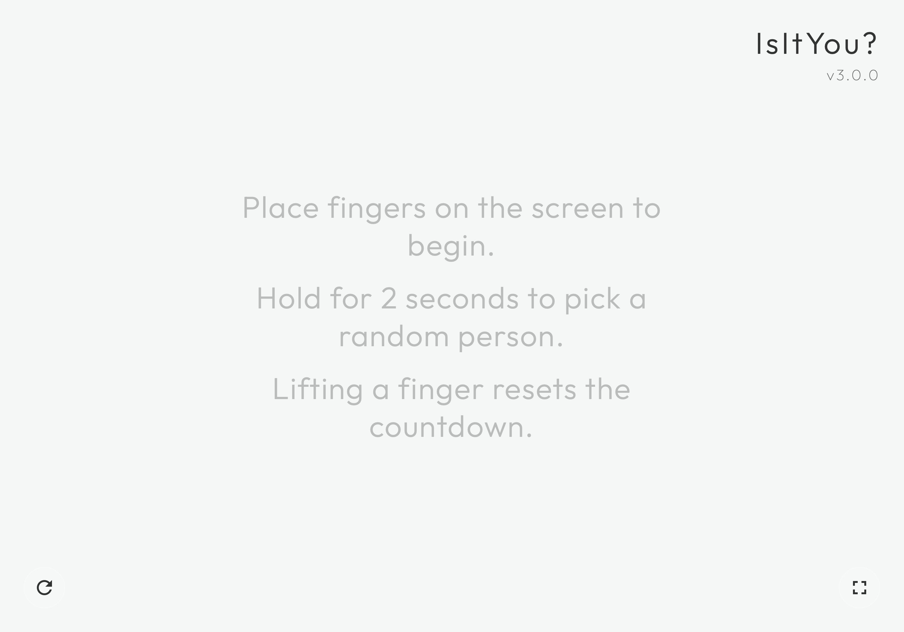

# IsItYou

[Deployed Here.](https://akwastaken.github.io/IsItYou)

A lightweight, responsive web application designed for touch-capable devices that randomly selects one finger from multiple participants holding their fingers on the screen. It is ideal for decision-making or turn-selection in group settings.

---

## Features

* **Multi-touch Tracking**: Monitors and renders distinct touch points simultaneously using an HTML5 canvas.
* **Selection Workflow**: Triggers a full-screen pulsing animation after 2 seconds of sustained contact, followed by a random selection.
* **Visual Hierarchy**: Uses distinct styles to separate active touches from the chosen selection, which features a multi-layered gold glow effect.
* **Control UI**: Includes explicit UI toggles for full-screen mode and manual canvas state resets.
* **State Management**: Resets the selection state immediately if any finger is removed prematurely during the countdown.

---

## Technical Architecture

The core functionality is encapsulated within the `TouchRandomizer` class:

* **Event Handling**: Tracks pointer positions using explicit `touchstart`, `touchmove`, and `touchend` event listeners linked to a JavaScript `Map`.
* **Rendering Loop**: Operates on a continuous `requestAnimationFrame` cycle to redraw touch circles and manage alpha-channel fading transitions.
* **Adaptive Layout**: Automatically handles canvas resizing on orientation changes or window resize actions.

---

## Getting Started

### Prerequisites

A modern web browser with touch event support (e.g., Safari on iOS, Chrome on Android, or a laptop with a touch-enabled screen).

### Installation and Usage

1. Clone or download the project files.
2. Ensure you have the accompanying `styles.css` file in the same directory.
3. Open `index.html` directly in a browser or serve it via a local development server.
4. Place multiple fingers on the screen and hold for 2 seconds to initiate the random selection process.
